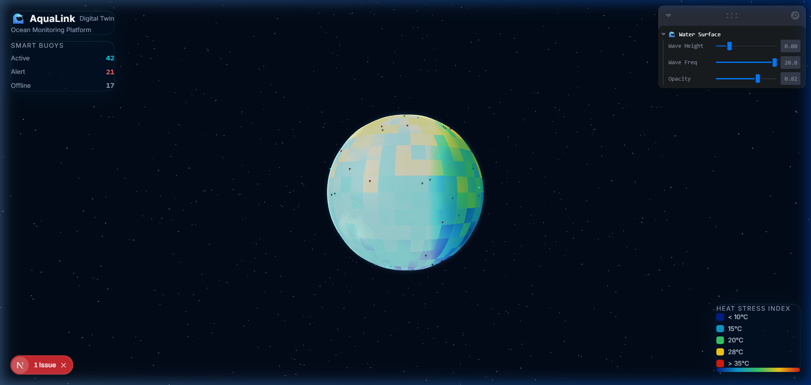
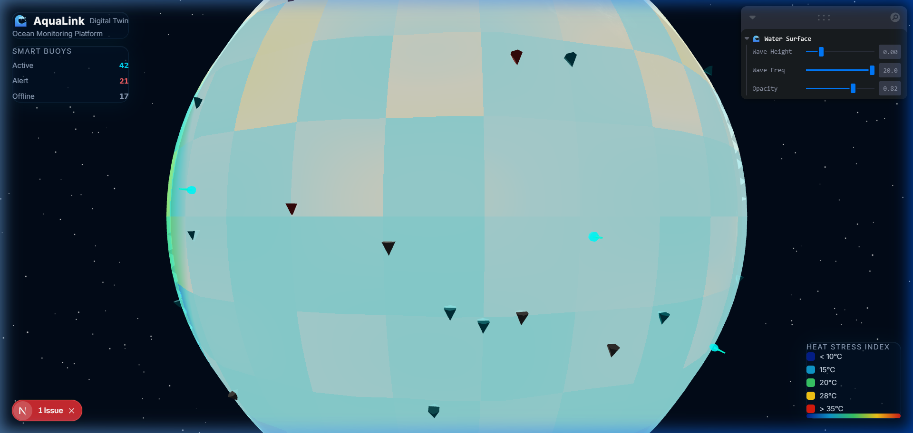
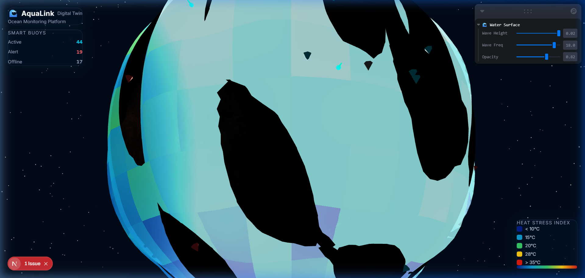
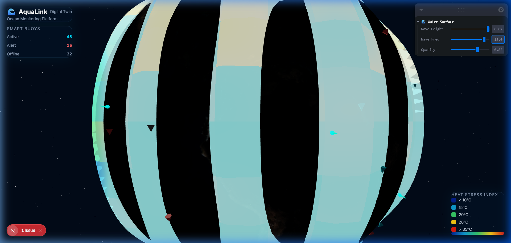
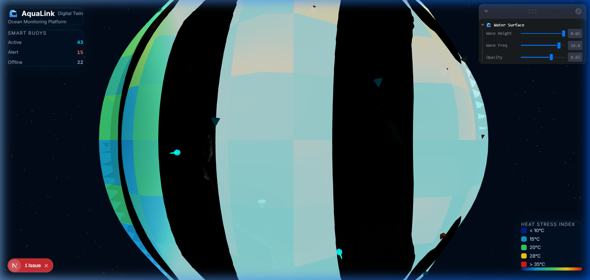
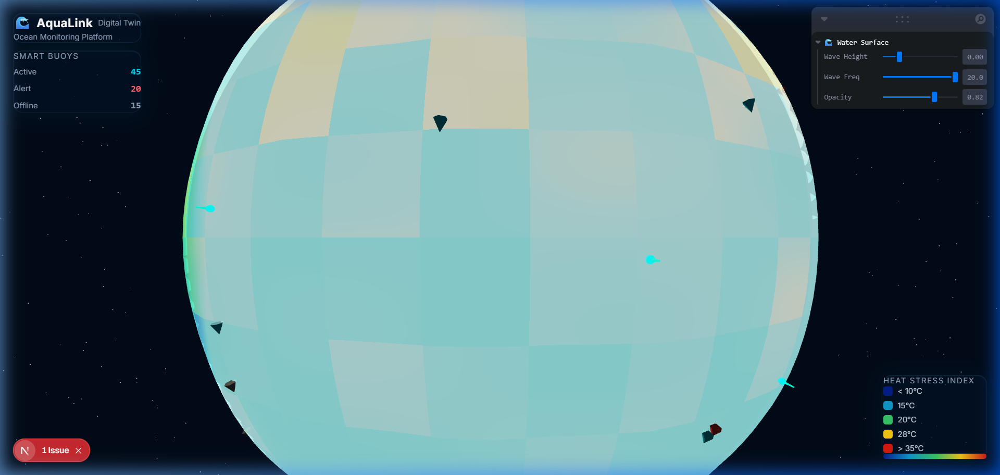
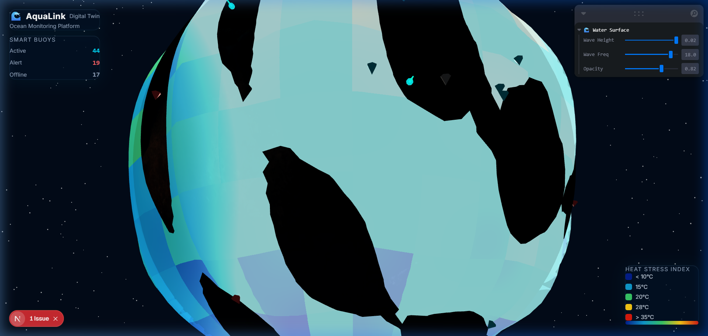
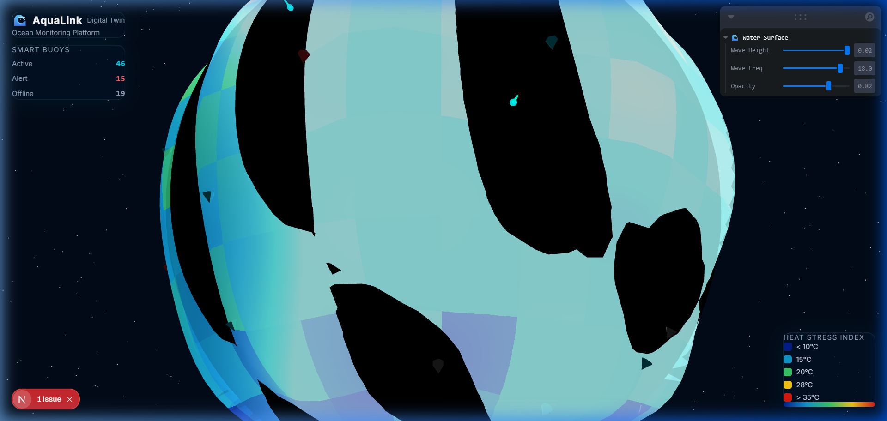
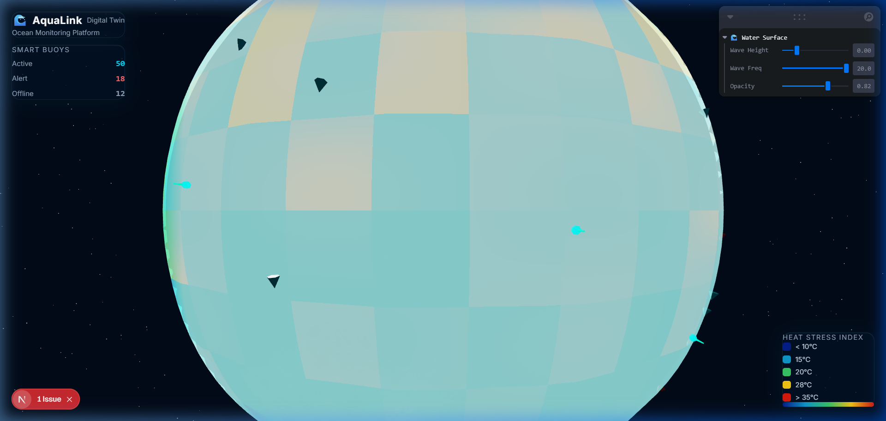

<div align="center">
  <h1 style="background: -webkit-linear-gradient(45deg, #00c6ff, #0072ff); -webkit-background-clip: text; -webkit-text-fill-color: transparent; font-weight: 900; letter-spacing: -1px;">🌊 AquaLink — Ocean Digital Twin Dashboard</h1>
  
  <p><strong>Real-time ocean monitoring. Live 3D visualization. Powered by IoT smart buoys.</strong></p>

  <div>
    
    
    
    
    
  </div>
  <br />
</div>


AquaLink is a browser-based **Digital Twin** of the ocean — an interactive 3D globe that mirrors the real state of the sea by ingesting telemetry from smart buoy sensors. It turns raw data into instant, visual intelligence for marine scientists, reef conservationists, and offshore operators.

---

<h2 style="color: #0072ff; border-bottom: 2px solid #00c6ff; padding-bottom: 8px;">🌍 The Problem We Solve: From Spreadsheets to Intelligence</h2>

### ❌ The Old Way (Reactionary)
It’s Tuesday morning. A marine biologist at a coastal protection agency receives an email with 80 CSV files—one from each buoy deployed overnight. By 10 AM, she opens spreadsheet #47 and notices buoy `AUL-047` recorded a water temperature of **31.8°C** at 2 AM. That’s above the coral bleaching threshold. 

She escalates the finding. The response team is dispatched on Thursday. By then, the coral has already begun bleaching.

### ✅ The AquaLink Way (Proactive)
She opens the AquaLink dashboard at 7 AM. The globe is spinning. Buoy `AUL-047` is **flashing red**, surrounded by a warm-orange heat zone on the water. She clicks the buoy—live temperature, salinity, and depth pop up instantly. She hovers over a glowing teal pin nearby: *Great Barrier Reef (12km away)*.

The response team is dispatched by 7:15 AM.

> **That is the difference between reading a weather report and watching a live radar. AquaLink makes the invisible, instantly understandable.**

---

<h2 style="color: #0072ff; border-bottom: 2px solid #00c6ff; padding-bottom: 8px;">✨ Features & Visual Tour</h2>

We don’t just show data; we make it tangible. Here is how AquaLink brings the ocean to your screen.

### 🌐 Interactive 3D Globe
A full Earth rendered with high-res NASA satellite textures (diffuse, normal, and specular maps), wrapped in a custom additive-blended atmosphere glow shader.
<p float="left">
  
  
</p>

### 🌡️ Live Heat Stress Shaders
The ocean surface is a dynamic mesh driven by a custom GLSL shader. It maps normalized temperature data to a 5-stop color ramp (Cold Polar Blue → Heat Stress Red) and animates the surface with vertex displacement waves.
<p float="left">
  
  
</p>

### 📍 Smart Buoys & Live Telemetry
Up to 80+ buoys are rendered simultaneously using an highly optimized `InstancedMesh` (a single GPU draw call). 
- **Cyan**: Normal
- **Red**: Alert (heat stress)
- **Grey**: Offline

**Click any buoy** to slide open the telemetry panel showing live temperature, salinity, depth, and GPS coordinates.
<p float="left">
  
  
</p>

<h3 style="color: #00c6ff;">🪸 Coral Reef Protection</h3>
Major vulnerable reef systems (like the Coral Triangle or Maldives Atoll) are pinned directly on the globe with glowing, pulsing markers. Hovering reveals their names, providing instant geographical context to nearby temperature spikes.
<p float="left">
  
  <!-- Reusing a good shot that shows the globe well for the second half -->
  
</p>

### 🎛️ Real-Time Shader Debugging (Leva)
A floating control panel allows operators (or developers) to tweak the GLSL uniform values in real-time. Adjust the wave height, wave frequency, and water opacity on the fly to see the shader react instantly.
<div align="center">
  
</div>

---

<h2 style="color: #0072ff; border-bottom: 2px solid #00c6ff; padding-bottom: 8px;">🧠 Technical Deep Dive</h2>

### High-Performance WebGL
Rendering 100s of 3D objects in a browser can quickly drop framerates. AquaLink stays at a buttery smooth 60fps through careful optimization:
1. **Instanced Rendering:** All 80+ buoy markers share a single `<instancedMesh>`. We update an `InstanceMatrix` buffer instead of looping through and rendering 80 separate geometries.
2. **Data Textures:** Passing a grid of temperature data to a shader can be expensive. We construct a `THREE.DataTexture` backed by a `Uint8Array` (encoding data into the Red channel). This ensures maximum compatibility even on older mobile GPUs that lack the `OES_texture_float` extension.

### The Water Shader Magic
The water surface is a transparent sphere (`radius = 1.008`) sitting just above the Earth mesh.
- **Vertex Shader:** Displaces each vertex along its normal direction using overlapping sine/cosine waves driven by `uTime`.
- **Fragment Shader:** Samples the temperature `DataTexture`, maps it to a color ramp, and calculates a Fresnel rim glow to capture the luminous "ocean horizon" effect at grazing angles.

### Architecture Data Flow
```text
[ IoT Smart Buoys ] ──(telemetry)──> [ Next.js API Routes ] 
                                           │
                                     (polls every 30s)
                                           ▼
[ UI Overlays ] <──(reads state)──> [ Zustand Global Store ] ──(drives)──> [ 3D WebGL Canvas ]
  - HUD Panel                         - buoys[]                              - GlobeMesh
  - Buoy Details                      - heatStressGrid[]                     - WaterShader
  - Legend                            - reefs[]                              - InstancedBuoys
```

---

<h2 style="color: #0072ff; border-bottom: 2px solid #00c6ff; padding-bottom: 8px;">🚀 Getting Started</h2>

Want to run the Digital Twin locally? You only need Node.js installed.

```bash
# 1. Clone the repository
git clone https://github.com/Suraj-kummar/AquaLink-.git
cd AquaLink-

# 2. Install dependencies
npm install

# 3. Start the development server
npm run dev
```

Open [http://localhost:3000](http://localhost:3000) in your browser. The app will automatically fall back to a realistic mock data generator, so the dashboard will populate with active buoys and heat stress maps immediately.

---

<h2 style="color: #0072ff; border-bottom: 2px solid #00c6ff; padding-bottom: 8px;">🏢 Real-World Use Cases</h2>

- 🪸 **Coral Reef Conservation:** Monitor heat stress near reef systems to predict and mitigate bleaching events.
- 🛢️ **Offshore Energy:** Track localized ocean conditions around oil rigs and wind farms for structural safety.
- 🚢 **Maritime Routing:** Identify rogue current or salinity anomaly zones along major shipping routes.
- 🎓 **Marine Research:** Visualize multi-buoy datasets spatially, replacing static charts with interactive exploration.

---

<div align="center">
  <p><i>Built with standard web technologies to push the limits of what a browser can visualize.</i></p>
  <p>MIT © AquaLink Contributors</p>
</div>
