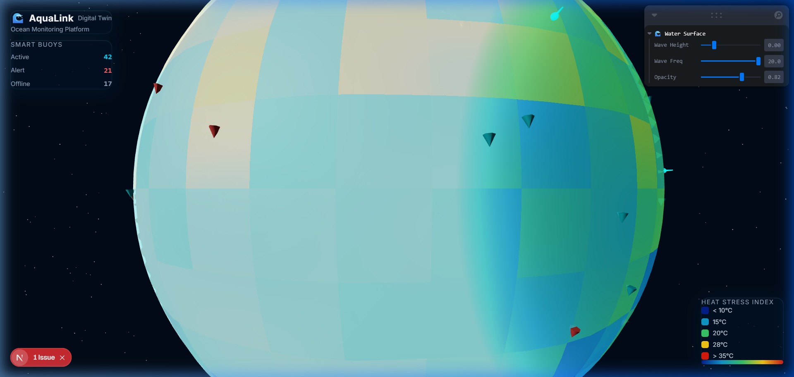

# 🌊 AquaLink — Ocean Digital Twin Dashboard

> **Real-time ocean monitoring. Live 3D visualization. Powered by IoT smart buoys.**

AquaLink is a browser-based **Digital Twin** of the ocean — a live, interactive 3D globe that mirrors the real state of the sea by ingesting data from smart buoy sensors deployed across the world's oceans. It turns raw telemetry into instant, visual intelligence for marine scientists, coast guards, reef conservationists, and offshore operators.

---

## 📸 Dashboard Screenshots

### 🌐 Main Dashboard — Full Overview


### 🔍 Zoomed In — Buoy Detail


### 🔄 Globe Rotated — Pacific Ocean View


### 📍 Smart Buoy — Live Telemetry Panel


### 🎛️ Leva Debug Panel — Real-Time Shader Controls


### 🌊 Maximum Wave Height — Shader in Action


### 🔴 Alert Buoys — Heat Stress Detected


### 📊 HUD Stats — Live Buoy Counts


### 🌡️ Heat Stress Index Legend


### ✨ Globe in Deep Space — Starfield View


---


## 🌍 The Real-World Problem We Solve

### Imagine this scenario:

> It's Tuesday morning. A marine biologist at the **Great Barrier Reef Marine Park Authority** receives an email with 80 CSV files — one per buoy — from the overnight data dump. She opens spreadsheet #47 and notices buoy `AUL-047` recorded a water temperature of **31.8°C** at 2 AM. That's above the coral bleaching threshold.
>
> She escalates it. By the time the response team is dispatched — it's Thursday. The coral in that section has already started bleaching.

**With AquaLink:**

> She opens the dashboard at 7 AM. Buoy `AUL-047` is **flashing red on the globe**, surrounded by a warm-orange heat zone. She clicks it — temperature, salinity, depth pop up instantly. She sees the Great Barrier Reef marker nearby is only 12 km away. Response dispatched by 7:15 AM.

**That's the difference between a spreadsheet and a Digital Twin.**

---

## ✨ Features

### 🌐 3D Interactive Globe
- Full Earth rendered with **NASA satellite textures** (atmosphere, normal map, specular)
- Realistic **atmosphere glow shader** (additive blending rim light)
- Slow realistic rotation; **drag to rotate, scroll to zoom**, smooth damping
- 6,000-star deep space background

### 🌡️ Live Heat Stress Visualization
- Ocean surface overlaid with a **custom GLSL shader** that maps water temperature to color
- Color ramp: 🔵 Cold polar → 🩵 Cool → 🟢 Temperate → 🟡 Warm → 🔴 Heat stress
- Animated ripple effect on the surface for visual realism
- Fresnel rim glow at ocean horizon angles

### 📍 Smart Buoy Markers
- Up to **80+ buoys** rendered as a single GPU draw call using `InstancedMesh`
- Color-coded by status:
  - 🩵 **Cyan** = Normal (operating within thresholds)
  - 🔴 **Red** = Alert (temperature/salinity breach detected)
  - ⬜ **Grey** = Offline (signal lost or hardware fault)
- **Click any buoy** → slide-in telemetry panel showing live temperature, salinity, depth, GPS coords, and last-updated timestamp
- Selected buoy **pulses** to confirm selection

### 🪸 Coral Reef Markers
- 5 major reef systems pinned on the globe:
  - Great Barrier Reef, Coral Triangle, Caribbean Reef System, Maldives Atoll, Red Sea Reef
- Glowing teal pins with animated pulse
- **Hover → tooltip** label appears so operators know what reef they're near

### 🎛️ Real-Time Debug Controls (Leva)
- Floating control panel with 3 live sliders:
  - **Wave Height** — controls ocean surface wave amplitude (0 → 0.02)
  - **Wave Freq** — controls wave frequency (2 → 20)
  - **Opacity** — controls water surface transparency (0.4 → 1.0)
- Changes reflect on the globe **immediately** (every animation frame)

### 🔄 Live Data Polling
- Buoy telemetry **auto-refreshes every 30 seconds** in the background
- No page reload needed — data flows continuously like a real monitoring system
- Graceful cleanup on component unmount (no memory leaks)

### 🛡️ Error Boundary
- If the WebGL engine or any 3D component crashes, a **styled fallback screen** appears instead of a blank white page
- Shows the error message and a **"🔄 Reload Dashboard"** button

### 📱 Mobile Responsive
- HUD panels adapt gracefully to small screens
- Controls hint hidden on mobile (saves space)
- Buoy detail panel switches to a **bottom-sheet** layout on phones

---

## 🏗️ Architecture

```
┌─────────────────────────────────────────────────────────┐
│                    Browser (Next.js App)                 │
│                                                          │
│  ┌──────────────┐     ┌──────────────────────────────┐  │
│  │  UI Overlays │     │       3D Canvas (R3F)        │  │
│  │  ─────────── │     │  ─────────────────────────   │  │
│  │  HUD.tsx     │     │  Globe.tsx  (Earth mesh)     │  │
│  │  BuoyPanel   │     │  WaterSurface.tsx (GLSL)     │  │
│  │  ErrorBound  │     │  BuoyMarkers.tsx (Instanced) │  │
│  └──────────────┘     │  ReefMarkers.tsx (Pins)      │  │
│                       │  Stars, Lights, OrbitControls│  │
│                       └──────────────────────────────┘  │
│                                   │                      │
│                     ┌─────────────▼──────────────┐       │
│                     │    Zustand Global Store    │       │
│                     │  buoys │ heatGrid │ reefs  │       │
│                     └─────────────┬──────────────┘       │
│                                   │                      │
│                     ┌─────────────▼──────────────┐       │
│                     │      aquaLinkApi.ts        │       │
│                     │  fetchBuoys / fetchHeat /  │       │
│                     │  fetchReefs  (+ mock data) │       │
│                     └─────────────┬──────────────┘       │
└───────────────────────────────────┼─────────────────────┘
                                    │ HTTP (every 30s)
                     ┌──────────────▼──────────────┐
                     │    Backend API (optional)   │
                     │  /api/buoys                 │
                     │  /api/heat-stress           │
                     │  /api/reefs                 │
                     └─────────────────────────────┘
                                    ▲
                     ┌──────────────┴──────────────┐
                     │   IoT Smart Buoys (Real)    │
                     │  Temp • Salinity • Depth    │
                     │  GPS • Battery • Status     │
                     └─────────────────────────────┘
```

---

## 🗂️ Project Structure

```
src/
├── app/
│   ├── page.tsx          # Main dashboard page
│   ├── layout.tsx        # Root layout + metadata
│   └── globals.css       # Glass-card UI system + global styles
│
├── components/
│   ├── 3d/
│   │   ├── Scene.tsx         # Three.js Canvas, lighting, data bootstrap
│   │   ├── Globe.tsx         # Earth sphere + atmosphere glow shader
│   │   ├── WaterSurface.tsx  # Custom GLSL water + temperature heat map
│   │   ├── BuoyMarkers.tsx   # InstancedMesh buoy cones + click handler
│   │   └── ReefMarkers.tsx   # Reef pin markers with hover labels
│   └── ui/
│       ├── HUD.tsx           # Brand card, buoy stats, heat legend
│       ├── BuoyPanel.tsx     # Slide-in buoy telemetry detail panel
│       └── ErrorBoundary.tsx # WebGL crash fallback screen
│
├── lib/
│   ├── aquaLinkApi.ts    # API fetchers + full offline mock data
│   └── geoUtils.ts       # lat/lng → Vector3, temperature texture builder
│
├── shaders/
│   ├── waterSurface.vert # Wave displacement vertex shader
│   └── waterSurface.frag # Temperature color ramp + Fresnel fragment shader
│
└── store/
    └── oceanStore.ts     # Zustand store (buoys, heatGrid, reefs, selectedBuoy)
```

---

## ⚙️ Tech Stack

| Layer | Technology |
|---|---|
| Framework | [Next.js 16](https://nextjs.org/) (App Router + Turbopack) |
| Language | TypeScript 5 |
| 3D Engine | [Three.js](https://threejs.org/) via [@react-three/fiber](https://docs.pmnd.rs/react-three-fiber) |
| 3D Helpers | [@react-three/drei](https://github.com/pmndrs/drei) (OrbitControls, Stars, Html, useTexture) |
| State | [Zustand](https://github.com/pmndrs/zustand) |
| Debug Controls | [Leva](https://github.com/pmndrs/leva) |
| Styling | Tailwind CSS v4 + custom glass-morphism system |
| Shaders | Custom GLSL (vertex + fragment) via `shaderMaterial` |

---

## 🚀 Getting Started

### Prerequisites
- Node.js ≥ 18
- npm ≥ 9

### Installation

```bash
# Clone the repo
git clone https://github.com/your-username/aqaiklink.git
cd aqaiklink

# Install dependencies
npm install

# Start the development server
npm run dev
```

Open [http://localhost:3000](http://localhost:3000) in your browser.

### Environment Variables (Optional)

By default, AquaLink runs fully offline with realistic mock data.  
To connect a real backend API, create a `.env.local` file:

```env
NEXT_PUBLIC_AQUAINK_API_URL=https://your-api.example.com
```

When this variable is set, AquaLink will call:
- `GET /api/buoys` → returns `BuoyData[]`
- `GET /api/heat-stress` → returns `HeatCell[]`
- `GET /api/reefs` → returns `ReefCoord[]`

---

## 🔌 API Data Contracts

```typescript
// A smart buoy sensor reading
interface BuoyData {
  id: string;           // e.g. "buoy-047"
  lat: number;          // GPS latitude (-90 to 90)
  lng: number;          // GPS longitude (-180 to 180)
  temperature: number;  // Water temp in °C
  salinity: number;     // Salinity in PSU (practical salinity units)
  depth: number;        // Depth in meters
  status: 'normal' | 'alert' | 'offline';
  lastUpdated: string;  // ISO 8601 timestamp
}

// A cell in the ocean heat stress grid
interface HeatCell {
  lat: number;
  lng: number;
  temperature: number;  // Normalized 0–1 (0 = polar cold, 1 = extreme heat)
}

// A coral reef anchor point
interface ReefCoord {
  id: string;
  name: string;         // e.g. "Great Barrier Reef"
  lat: number;
  lng: number;
}
```

---

## 🧠 How the Shader Works

The water surface is a transparent sphere (`radius = 1.008`) sitting just above the Earth mesh. It uses a custom `ShaderMaterial` with two GLSL programs:

**Vertex shader** — displaces each vertex along its normal direction to create ocean waves:
```glsl
float wave1 = sin(position.x * uWaveFrequency + uTime * 1.2) * uWaveAmplitude;
float wave2 = cos(position.z * uWaveFrequency * 0.8 + uTime * 0.9) * uWaveAmplitude * 0.6;
vec3 displacedPosition = position + normal * (wave1 + wave2);
```

**Fragment shader** — samples a `DataTexture` (temperature grid) and maps it through a 5-stop color ramp:
```glsl
// Cold polar → Cyan cool → Green temperate → Yellow warm → Red extreme
vec3 temperatureColor(float t) { ... }
```

The temperature texture uses `Uint8Array` (not `Float32Array`) for maximum WebGL compatibility — avoids the `OES_texture_float` extension requirement which fails on many mobile GPUs.

---

## 🆚 How AquaLink Differs from Other Tools

| Capability | MATLAB Oceanography | Generic Dashboards | AquaLink |
|---|---|---|---|
| Real-time 3D globe | ❌ | ❌ | ✅ |
| Heat stress color map | ✅ (2D plots) | ❌ | ✅ (3D on globe) |
| Click buoy → live data | ❌ | ❌ | ✅ |
| Reef risk overlay | ❌ | ❌ | ✅ |
| Runs in any browser | ❌ | ✅ | ✅ |
| No installation needed | ❌ | ✅ | ✅ |
| Custom shader rendering | ❌ | ❌ | ✅ |
| Open source / extensible | ❌ | Varies | ✅ |

---

## 🌏 Real-World Use Cases

- 🪸 **Coral Reef Conservation** — Monitor heat stress near reef systems and get instant alerts before bleaching events
- 🛢️ **Offshore Energy** — Track ocean conditions around oil rigs and wind farms
- 🚢 **Maritime Safety** — Identify rogue current or salinity anomaly zones along shipping routes
- 🎓 **Marine Research** — Visualize multi-buoy datasets spatially instead of comparing spreadsheets
- 🏄 **Coastal Management** — Monitor water quality in real time for beach safety decisions

---

## 📄 License

MIT © AquaLink Contributors

---

> *"AquaLink is to ocean monitoring what live traffic radar was to navigation — it makes the invisible, instantly understandable."*
